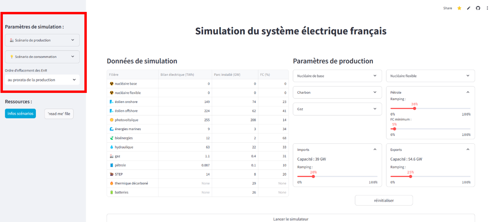
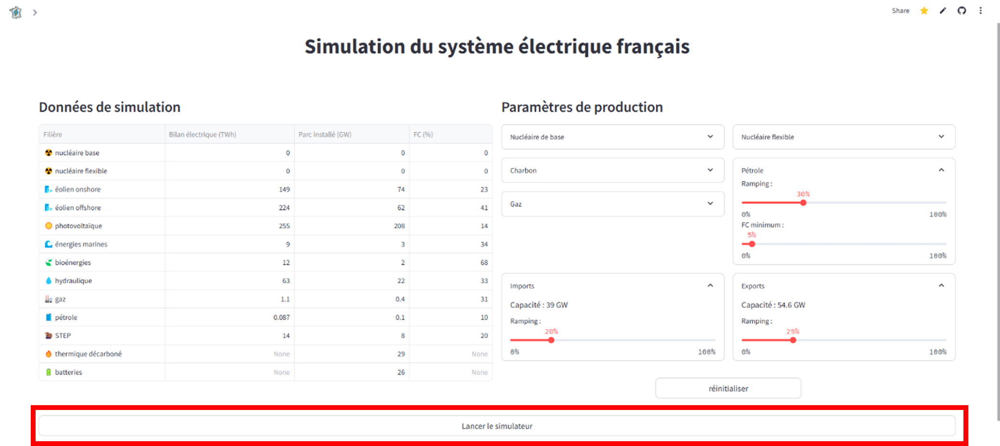

# Simulateur du Système Électrique Français
<!-- Remplacez par le chemin de votre image -->

## Préambule
La France, à travers la loi énergie-climat du 8 novembre 2019, s'est engagée à atteindre la neutralité carbone d'ici 2050. Cela impose une transformation profonde, notamment dans le secteur énergétique. En réponse, RTE a publié le rapport Futurs énergétiques 2050, explorant plusieurs trajectoires de décarbonation du système électrique tout en garantissant la sécurité d'approvisionnement.

Ce simulateur pédagogique et analytique vise à sensibiliser les utilisateurs aux défis et aux choix stratégiques de la transition énergétique. Il combine des scénarios de production et de consommation issus du rapport Futurs énergétiques 2050.

Le projet s'appuie sur les travaux de Madame LOISEL et Monsieur PINDER réalisés en 2020 dans le cadre du projet WEAMEC « EMA ».

## Définitions
- Ramping : Capacité d'une installation à faire varier sa production :
  - Pmax/min(t=h) = +/- Ramping * P(t=h-1)
- Effacement : Excès ou défaut d'énergie non compensable.
  - Effacement positif : défaut de production.
  - Effacement négatif : surproduction.
- Soldes échanges : Différence entre exportations et importations :
SE(t=h) = exportations(t=h) - importations(t=h)
- Variation nécessaire : Demande de variation de production aux usines pilotables.
- STEP (Station de Transfert d'Énergie par Pompage) : Système de stockage d'énergie par pompage-turbinage.
- Thermique décarboné : Production thermique utilisant de l'hydrogène produit par électrolyse.
- Facteur de Capacité (FC) : Ratio d'utilisation d'une installation.

## Navigation

**1 .** Sélectionner un scénario de production et un scénario de consommation

**2.** Lancer le simulateur

**3.** Analyser les résultats de la simulation

## Principales hypothèses
- Nucléaire : 66% en base, 33% flexible.
- Disponibilité annuelle du parc nucléaire :
  - Décembre-Mars : 91%
  - Mars-Mai : 80%
  - Mai-Novembre : 67%
  - Novembre-Décembre : 80%
- Ancien thermique : 80% gaz, 20% pétrole.
- Facteur de capacité : gaz ≈ 30%, pétrole ≈ 10%.
- Capacité d'export : 1.4 * capacité d'import.
- Facteur de capacité STEP : ≈ 20%.
- Pertes réseau : 7%.

## Description
Le simulateur modélise le dispatching des générateurs programmables et intermittents au pas horaire sur une année (2050). Il reproduit le fonctionnement du marché d'électricité selon l'ordre de mérite des coûts marginaux de production.

### Entrées :
- Capacités installées en début d'année.
- Facteurs de capacité horaires pour l'hydroélectricité, l'éolien (terrestre et marin) et le solaire.
- Contraintes opérationnelles (ramping, seuils minimaux).
- Interconnexions import-export.
- Profil horaire de la demande.
- Taux de pertes.
### Sorties :
- Production horaire par technologie.
- Flux import-export.
- Effacement horaire de l'offre.
- Manques d'offre ponctuels.
- Cycles de charge /décharge du parc de batteries

Le simulateur respecte l'équilibre entre l'offre et la demande tout en prenant en compte les contraintes opérationnelles des centrales et la disponibilité des facteurs naturels.

## Documentation
- RTE [Futurs énergétiques 2050](https://www.rte-france.com/analyses-tendances-et-prospectives/bilan-previsionnel-2050-futurs-energetiques)
- Projet WEAMEC « EMA » : [Lien du projet](https://www.weamec.fr/moyens-logiciels/simulateur-ssef/)
